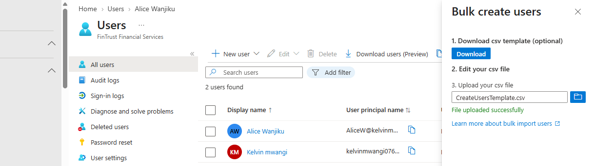
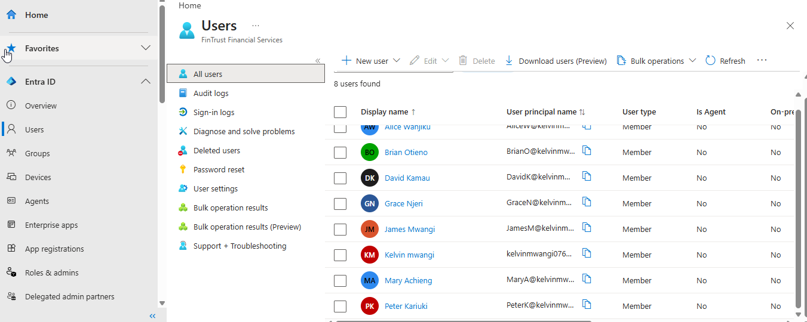
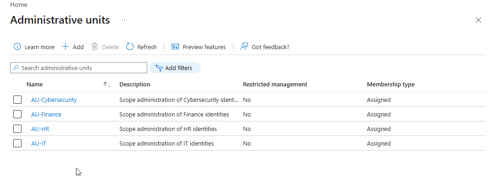

# 
Here we implement our scenario. We take it from what words to action.      

## 1. Tenant Information

### 1.1 Tenant Details

Tenant Name - FinTrust Financial Services
Primary Domain - kelvinmwangi076946gmail.onmicrosoft.com
Tenant Type - Workforce

## 2. User Implementation
5.1 Representative Users

The following fictional identities were created for the FinTrust lab.

| Name | Department | Job Title | Account Type |
|---|---|---|---|
| Alice Wanjiku | Finance | Finance Officer | Member |
| Brian Otieno | Human Resources | HR Officer | Member |
| David Kamau | IT | IT Administrator | Member |
| Grace Njeri | Cybersecurity | Security Analyst | Member |
| James Mwangi | Loans | Loan Officer | Member |
| Mary Achieng | Customer Support | Customer Support Officer | Member |
| Peter Kariuki | Management | Manager | Member |

All identities used in this project are fictional.

 
Alice was the first User.
 
Then I created the users in bulk using CSV.
 
Check them out.

## 3. Group Implementation
### 3.1 Naming Convention

The FinTrust group naming convention is:

**FT**-**Department**-**Purpose**

Examples:

- FT-Finance-Users
- FT-HR-Users
- FT-IT-Users
- FT-Cybersecurity-Users
- FT-Loans-Users
- FT-CustomerSupport-Users
- FT-Management-Users

### Understanding Groups

In Microsoft Entra ID, Security groups and Microsoft 365 groups are two different group types because they serve different organizational purposes.

1. #### Security group
A Security group is primarily used to control access and permissions.
In our case a group like **FT-Finance-Users** will be used by **Finance users** who have Access to **Finance resources**

> #### More of what a security group can be used for:

> - Assigning access to applications
> - Assigning Azure resources
> - Controlling access to files/resources
> - Group-based licensing
> - Organizing users for administration

2. #### Microsoft 365 group

A Microsoft 365 group is designed more for collaboration.
It can provide a shared collaboration environment for members, depending on the Microsoft 365 services available in the tenant.

> As a Junior IAM analyst this was the take away: **Security Group** is when need to organize users so I can manage access while **Microsoft 365 group** is when I need a team to collaborate around shared Microsoft 365 resources.

| Membership Type | What It Means | Managed By | Example |
|---|---|---|---|
| Assigned | Members are manually added or removed | Administrator | Add Alice to Finance group |
| Dynamic User | Users are automatically added or removed based on user attributes and rules | Microsoft Entra ID | `department = Finance` |
| Dynamic Device | Devices are automatically added or removed based on device attributes and rules | Microsoft Entra ID | `operatingSystem = Windows` |

**Assigned** is appropriate in small organisation because you're deliberately controlling who belongs to each departmental group. 
**Dynamic User** and **Dynamic Device** This is extremely useful in larger organizations. I will dive more into creating this policies in a future project.

### 3.2 Groups Created and Members added

| Group | Type | Membership | Purpose | Member |
|---|---|---|---|---|
| FT-Finance-Users | Security | Assigned | Finance users | Alice Wanjiku |
| FT-HR-Users | Security | Assigned | Human Resources users | Brian Otieno |
| FT-IT-Users | Security | Assigned | IT users | David Kamau |
| FT-Cybersecurity-Users | Security | Assigned | Cybersecurity users | Grace Njeri |
| FT-Loans-Users | Security | Assigned | Loans users | James Mwangi |
| FT-CustomerSupport-Users | Security | Assigned | Customer Support users | Mary Achieng |
| FT-Management-Users | Security | Assigned | Management users | Peter Kariuki |

## 4. Group Design Decision
Why use groups?

FinTrust avoid managing access by assigning permissions individually to every user whenever a group-based approach is appropriate.

The intended model is:

User  
  ↓  
Group 
  ↓ 
Resource / Application / Permission 

Instead of:

User 
  ↓ 
Individual Permission 

This improves:

- Manageability
- Consistency
- Access reviews
- User onboarding
- User offboarding
- Least-privilege administration
- Scalability

## 5. Administrative Units

Administrative Units can be used to create administrative boundaries within the organization.

#### What FinTrust is trying to achieve

FinTrust has several departments. The company does not necessarily want every administrator to have permission over every user in the organization.  
 
Why is it a risk? Because in a large organization, giving every administrator access to every identity creates a much larger blast radius.
 
Imagine FinTrust has 20,000 employees and 50 IAM/helpdesk administrators. 

If every administrator has broad tenant-wide permissions comes risks such as:

- Accidental changes: An administrator modifies the wrong user's account or group membership.
- Excessive privilege: A helpdesk administrator can perform actions unrelated to their job.
- Compromised account: If an administrator's account is compromised, the attacker inherits that administrator's broad permissions.
- Insider misuse: A legitimate administrator may have access to identities they have no business managing.
- Larger blast radius:	One mistake or compromised account can affect many more users.
- Separation of duties: Different departments may need different administrators and controls.
- Auditing: It becomes harder to determine why an administrator changed an unrelated user's account.

 
Administrative Units support least-privilege and delegated administration. By
reducing unnecessary administrative privilege and limiting the blast radius of mistakes or compromised administrator accounts. 

### 5.2 Creating the Administrative Units

Potential FinTrust AUs:

- AU-Finance
- AU-HR
- AU-IT
- AU-Cybersecurity

 

  
 

 

In our case, we have already created:

**AU-HR**
and assigned the appropriate administrative roles for your administrator Brian.

Now you need to add the HR employees whom that administrator will manage into AU-HR 
His role assignment gives him the administrative capability, while the AU membership of Susan, John, and Mary establishes the identities within his administrative scope.

 
Our current lab only has Brian, so we haven't demonstrated the full relationship yet. We will get to learn and do this more when we load more users. 