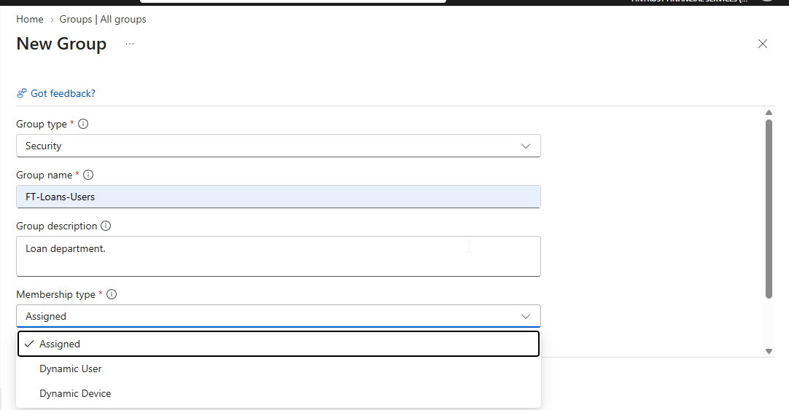
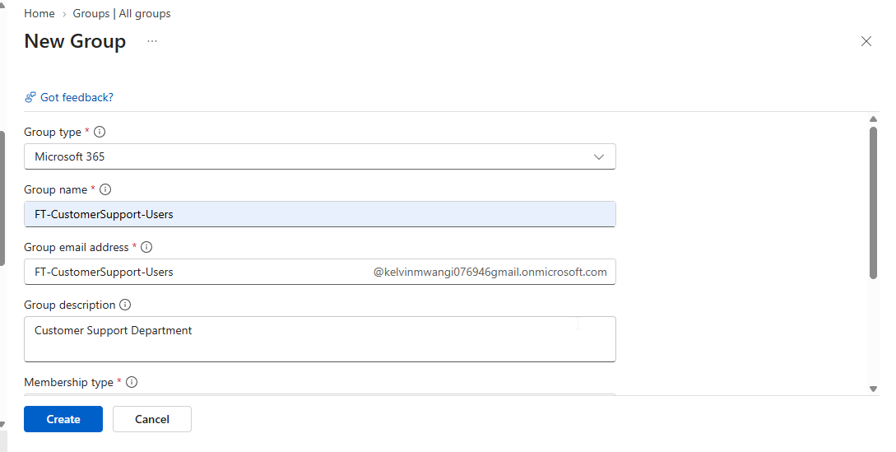
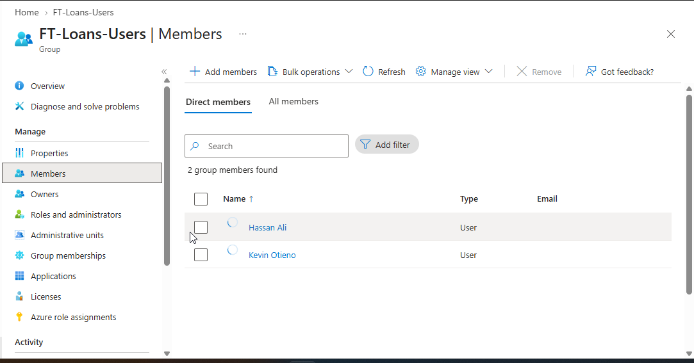

# 1. Creating a Security Group

In the Microsoft Entra admin center, an administrator can create a group and configure properties such as:

* Group type
* Group name
* Group description
* Membership type
* Owners
* Members

A typical configuration might be:

```text
Group type:
Security

Group name:
FT-Finance-Users

Membership type:
Assigned
```


The administrator can then add the required members.

---

# 2. Creating a Microsoft 365 Group

A Microsoft 365 group can be created when the purpose is collaboration.

Example:

```text
Group type:
Microsoft 365

Name:
FT-Cybersecurity-Team
```

Members can then collaborate through supported Microsoft 365 services associated with the group.


The important point is to choose the group type based on the intended purpose.

---

# 3. Adding Members

Members can be added individually.

Example:

```text
FT-Finance-Users

Add:
Alice Wanjiku
```

The group then becomes:

```text
FT-Finance-Users
    └── Alice Wanjiku
```


Additional members can be added as needed.



---

# 4. Removing Members

Members can also be removed.

Example:

```text
FT-Finance-Users

Current:
- Alice
- Brian
- David
- Grace
```

Remove:

```text
Brian
```

Result:

```text
FT-Finance-Users

Members:
- Alice
- David
- Grace
```

Removing a user from a group changes that user's membership in the group.

---

# 5. Bulk Membership Management

When an organization has many users, adding members individually can become inefficient.

For example:

```text
FT-Finance-Users

32 users
```

Instead of manually processing every user through the portal, administrators can use supported bulk-management methods.

The important concept is:

```text
Small group
→ Individual management may be practical

Large group
→ Bulk management or automation becomes useful
```

---

# 6. FinTrust Group Structure

```text
                    FINTRUST GROUPS
                          │
        ┌─────────────────┼─────────────────┐
        │                 │                 │
     Finance              HR                IT
        │                 │                 │
FT-Finance-Users    FT-HR-Users      FT-IT-Users

        │
        ├── Cybersecurity
        │   FT-Cybersecurity-Users
        │
        ├── Loans
        │   FT-Loans-Users
        │
        ├── Customer Support
        │   FT-CustomerSupport-Users
        │
        └── Management
            FT-Management-Users
```

The groups provide a structured way to organize FinTrust identities.

---

# 7. Assigned FinTrust Groups

For the first implementation, FinTrust can use assigned membership.

Example:

```text
FT-Finance-Users

Membership:
Assigned
```

Members are deliberately selected:

```text
Alice Wanjiku
Brian Otieno
David Kamau
```

The administrator controls membership manually.

---

# 8. Dynamic FinTrust Groups

FinTrust can also create dynamic groups where membership follows user attributes.

> (Currently, I dont have subscription to demonstrate this. I will tackle it another time.)

For example:

```text
FT-Finance-Dynamic
```

Rule:

```text
Department = Finance
```

Then:

```text
Finance users
      ↓
Department attribute
      ↓
Dynamic membership rule
      ↓
FT-Finance-Dynamic
```

This removes the need to manually maintain every member when the relevant attribute is maintained correctly.

---

# 9. Group Membership Scenario 

Suppose FinTrust has:

```text
Alice
Department = Finance

Brian
Department = IT

Mary
Department = HR
```

A dynamic group uses:

```text
Department = Finance
```

Membership becomes:

```text
FT-Finance-Dynamic

Alice
```

Brian and Mary are not included because their department values do not match the rule.

[Read More HERE](<Dynamic Group.md>)

---

# 10. Changing Membership Through Attributes

Suppose Brian initially has:

```text
Department = IT
```

Therefore:

```text
FT-IT-Dynamic
```

contains Brian.

Later his department changes to:

```text
Finance
```

The dynamic group rules can be reevaluated.

The expected membership relationship becomes:

```text
Brian
  ↓
Department = Finance
  ↓
FT-Finance-Dynamic
```

The important concept is that dynamic membership follows the configured rule rather than a manual add/remove operation.

---

# 11. Group Lifecycle

Groups also have a lifecycle.

A simplified lifecycle is:

```text
Plan
 ↓
Create
 ↓
Configure
 ↓
Add owners
 ↓
Add members
 ↓
Use
 ↓
Review
 ↓
Modify
 ↓
Remove members
 ↓
Delete when no longer required
```

Group administration does not end when the group is created.

Groups should continue to be managed throughout their useful life.

---

# 12. Group Description

A useful group description explains its purpose.

Example:

```text
FT-Finance-Users

Description:
Security group for FinTrust Finance department users.
```

Another example:

```text
FT-Finance-Dynamic

Description:
Dynamic security group containing users whose
department attribute is Finance.
```

Descriptions help administrators understand why a group exists.

---

# 13. Group Administration Checklist

When creating a group, consider:

```text
[ ] What is the purpose?
[ ] Security group or Microsoft 365 group?
[ ] What should the group be called?
[ ] What membership type is required?
[ ] Who owns the group?
[ ] Who should be members?
[ ] Should membership be assigned or dynamic?
[ ] If dynamic, what rule determines membership?
[ ] Does the group require licensing?
[ ] Is the group still required?
```

---

# 14. Common Group Mistakes

### Mistake 1 — Choosing the wrong group type

Creating a Microsoft 365 group when the requirement is primarily security/access management can create unnecessary complexity.

---

### Mistake 2 — Using manual membership when membership should be automatic

If the membership population is determined by a reliable user attribute, dynamic membership may be appropriate.

---

### Mistake 3 — Using dynamic membership without reliable attributes

Dynamic groups depend on the attributes used in their rules.

If the attributes are inaccurate:

```text
Incorrect attribute
      ↓
Incorrect rule evaluation
      ↓
Incorrect membership
```

---

### Mistake 4 — No group owner

Groups should have appropriate ownership and administration.

---

### Mistake 5 — Poor naming

Names such as:

```text
Group1
Test
NewGroup
Group2
```

do not clearly communicate purpose.

Prefer meaningful names such as:

```text
FT-Finance-Users
FT-HR-Users
FT-IT-Users
```

---

### Mistake 6 — Creating unnecessary groups

Every group should have a clear purpose.

Before creating one, ask:

> Why does this group need to exist?

---

# 15. Groups and PowerShell

Groups can be managed through automation.

Administrators can use PowerShell to:

* Create groups
* Retrieve groups
* Add members
* Remove members
* Retrieve members
* Manage group properties

For Microsoft Entra administration, Microsoft Graph PowerShell provides commands for interacting with Microsoft Graph.

Example concept:

```text
PowerShell
     ↓
Microsoft Graph PowerShell
     ↓
Microsoft Graph
     ↓
Microsoft Entra ID
     ↓
Groups
```

This is useful when managing many groups or automating repetitive administration.

---

# 16. Groups and Microsoft Graph

Microsoft Graph provides APIs for working with Microsoft Entra groups.

Conceptually:

```text
Script
  ↓
Microsoft Graph
  ↓
Groups
  ├── Create
  ├── Read
  ├── Update
  ├── Delete
  ├── Add members
  └── Remove members
```

This allows administrators to move from manual portal administration toward repeatable automation.

---

# 17. Groups and Azure CLI

Groups can also be managed using command-line tools.

The important concept is that the portal is not the only administration method.

An administrator can work with groups through:

```text
Microsoft Entra portal
        OR
PowerShell / Microsoft Graph
        OR
Azure CLI
```

The underlying identity service remains Microsoft Entra ID.

---

# 18. Group Administration Through the Portal

The Microsoft Entra admin center provides a graphical interface for group management.

Typical tasks include:

```text
Groups
  ↓
View groups
  ↓
Select group
  ↓
Manage:
  - Overview
  - Members
  - Owners
  - Properties
  - Membership
  - Licenses
```

The exact available options depend on the group type and configuration.

---

# 19. Group Properties

Groups have properties that describe or control the group.

Examples include:

* Display name
* Description
* Group type
* Membership type
* Owners
* Members

These properties help administrators identify and manage the group.

---

# 20. Group Membership Rules

Dynamic groups depend on membership rules.

Conceptually:

```text
IF user satisfies condition
        ↓
Include user in group
```

Example:

```text
IF Department = Finance
        ↓
FT-Finance-Dynamic
```

Another possible rule could be based on another supported user or device attribute.

The important point is:

> **A dynamic group does not require the administrator to manually maintain every member.**

---

# 21. Group-Based Organization

Groups can represent organizational populations.

For FinTrust:

```text
Department
     ↓
Group
     ↓
Members
```

Example:

```text
Finance
   ↓
FT-Finance-Users
   ↓
Finance employees
```

This provides a consistent organizational structure.

---

# 22. Groups Are Not Just Lists

A group is not merely a list of names.

It can become a management boundary for a collection of identities.

For example:

```text
List:

Alice
Brian
David
```

is simply a list.

But:

```text
FT-Finance-Users
```

is an identity-management object that can have:

* Owners
* Members
* Membership type
* Description
* Licensing configuration
* Group-based access relationships
* Administrative lifecycle

Therefore, group design is an important part of identity administration.

---

# 23. Group Design Principle

A good group should answer three questions:

### 1. Why does the group exist?

Example:

```text
Finance department users
```

### 2. Who should belong to it?

Example:

```text
Users whose department is Finance
```

### 3. How should membership be managed?

Example:

```text
Assigned
```

or:

```text
Dynamic
```

This gives the group a clear purpose.

---

# 24. FinTrust Group Design

The initial FinTrust design is:

| Group                      | Purpose                | Membership |
| -------------------------- | ---------------------- | ---------- |
| `FT-Finance-Users`         | Finance users          | Assigned   |
| `FT-HR-Users`              | HR users               | Assigned   |
| `FT-IT-Users`              | IT users               | Assigned   |
| `FT-Cybersecurity-Users`   | Cybersecurity users    | Assigned   |
| `FT-Loans-Users`           | Loans users            | Assigned   |
| `FT-CustomerSupport-Users` | Customer Support users | Assigned   |
| `FT-Management-Users`      | Management users       | Assigned   |

Dynamic versions can be created later for populations that can reliably be identified using supported attributes.

---

# 25. Group Troubleshooting

When a group does not behave as expected, check:

```text
[ ] Is the correct group selected?
[ ] Is the group type correct?
[ ] Is the membership type correct?
[ ] Is the user actually a member?
[ ] Is the user an owner or only a member?
[ ] Is the dynamic rule correct?
[ ] Are the attributes used by the rule correct?
[ ] Has dynamic membership been processed?
[ ] Is the relevant group-based configuration supported?
```

For dynamic groups, especially check:

```text
User attribute
       ↓
Rule
       ↓
Membership evaluation
       ↓
Group membership
```

---

# 26. Groups — Core Mental Model

The entire topic can be summarized as:

```text
                GROUP
                  │
        ┌─────────┼─────────┐
        │         │         │
      Type    Membership   Owners
        │         │         │
   ┌────┴───┐ ┌───┴────┐    │
   │        │ │        │    │
Security   M365     Assigned Dynamic
                    │        │
                    │        │
                 Manual     Rule
                    │        │
                    └───┬────┘
                        │
                     Members
                        │
                Group-based
                management
```

---

# 27. What You Should Be Able to Explain

After completing the Groups topic, you should be able to explain:

### 1. What is a group?

A group is a collection of supported identities managed as a unit.

### 2. Why are groups useful?

They reduce repetitive identity administration and provide a common management target.

### 3. What is a Security group?

A group primarily intended for security and access management.

### 4. What is a Microsoft 365 group?

A group primarily designed around Microsoft 365 collaboration.

### 5. What is assigned membership?

Membership manually controlled by an administrator or authorized group manager.

### 6. What is dynamic membership?

Membership automatically evaluated according to configured rules.

### 7. What is a group owner?

A user responsible for managing aspects of the group.

### 8. What is a group member?

An identity that belongs to the group.

### 9. What is group-based licensing?

A method of assigning supported licenses through group membership.

### 10. What is a nested group?

A group that contains another group as a member.

---

> **A group allows an administrator to manage a collection of identities as a unit instead of repeatedly managing each identity individually.**

