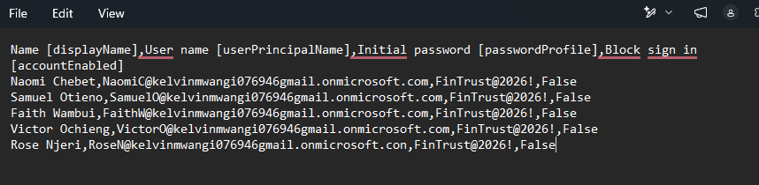
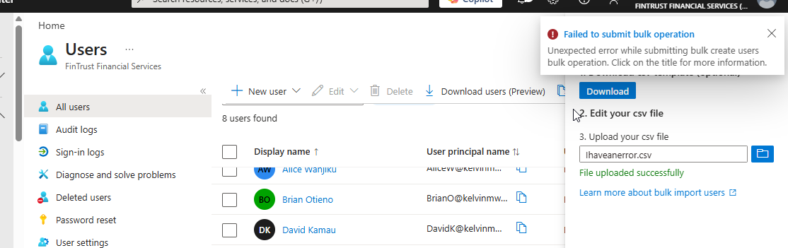
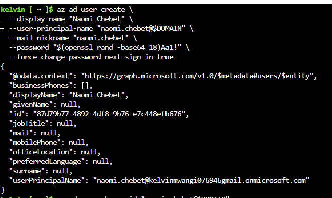
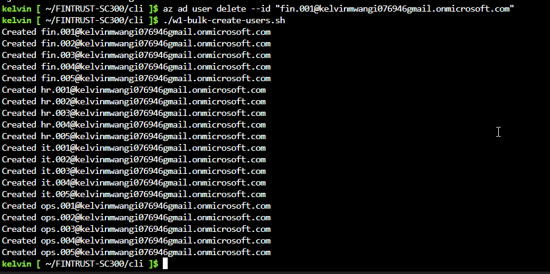
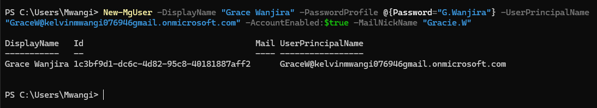

Users.

### User - A single personal verifiable identity in Microsoft Entra ID.

> Objective: FinTrust has a new employees. To create and onboard these identities to Microsoft Entra ID!

FinTrust is hiring employees across Finance, HR, IT, Cybersecurity, Loans and Customer Support. 

The IAM administrator must be able to onboard:  

- One employee quickly;
- Dozens/hundreds of employees;
- Users through automation;
- Users originating from an HR process.

The administrator must also understand what happens after creation: 

HR request 
    ↓ 
Create identity 
    ↓ 
Configure identity 
    ↓ 
Assign groups 
    ↓ 
Assign appropriate access 
    ↓ 
Authentication requirements 
    ↓ 
User starts work 

#### How do we onboard users in Microsoft Entra: There are 5 practical onboarding approaches.

1. Portal — single-user creation & bulk user creation
2. Azure CLI — scripted user creation
3. Microsoft Graph — API-based user creation
4. Automation/lifecycle — understand how HR-driven onboarding works

#### Single-user Creation

This is the simplest method. 

Go to: Microsoft Entra admin center → Identity → Users → All users → New user 

This is my first FinTrust employee. 

Use something like:

Property	Value
Display name	Alice Wanjiku
User principal name	AliceW@domain.onmicrosoft.com
Job title	Finance Officer
Department	Finance Resources
Usage location	Kenya
Account status	Enabled

 

#### Bulk-user Creation

Now imagine HR sends you 10 new employees. 

Creating them individually would be repetitive. 

Microsoft Entra provides bulk user operations using CSV. 

 

Uplaod in the bilk user creation section. 

The the users in bulk using CSV results. 
 
Check them out.

###### Troubleshooting.

I create a file With an error to check what will happen when I upload it. Check the last person UPN it has .con instead of .com.
 
 Boom! It was rejected. 

#### Azure CLI — scripted user creation

We can create user directly with CLI. 

 

Bulk users 
[Check the script that I used to Create Users](../../CLI/w1-bulk-create-users.sh) 
 

### Microsoft Graph PowerShell

Microsoft Graph PowerShell provides a command-line interface for administering Microsoft Entra ID through the Microsoft Graph API. Instead of performing identity administration manually through the Entra portal, I can use PowerShell commands to create, retrieve, modify, and delete directory objects programmatically. 

The `New-MgUser` command was used to provision individual users directly in Microsoft Entra ID.   
 

The `-DisplayName`, `-UserPrincipalName`, `-MailNickName`, `-PasswordProfile`, and `-AccountEnabled` parameters define the properties of the identity being created. This demonstrates that PowerShell is not creating a separate type of user; it is interacting with the same Entra directory through Microsoft Graph.
 
The `Remove-MgUser` command was then used to demonstrate the opposite lifecycle operation: deleting an identity from the directory.  
 

This introduced an important IAM concept — **identity lifecycle management** — where identities can be provisioned and deprovisioned through controlled administrative operations. 

For the FinTrust environment, I extended this approach to bulk provisioning. Rather than writing 32 individual `New-MgUser` commands, the user information was stored in a CSV file and imported with `Import-Csv`. PowerShell then processed each row and passed its values to `New-MgUser`. 

  
 

 
The workflow can therefore be represented as:

**CSV → PowerShell → Microsoft Graph → Microsoft Entra ID**  

 

This approach demonstrates how identity administration can move from manual portal-based operations toward repeatable and scalable automation. It also introduces an important security consideration: credentials must never be committed to a public GitHub repository. The actual lab CSV containing passwords is therefore kept outside the repository, while sanitized examples can be used for documentation.

The key lesson is that **Microsoft Graph is the underlying API layer, while Microsoft Graph PowerShell provides a PowerShell-based administration interface to that API**. Learning both the portal and Graph-based administration provides a deeper understanding of how Entra identity operations can be performed manually, through commands, and eventually through automation.
